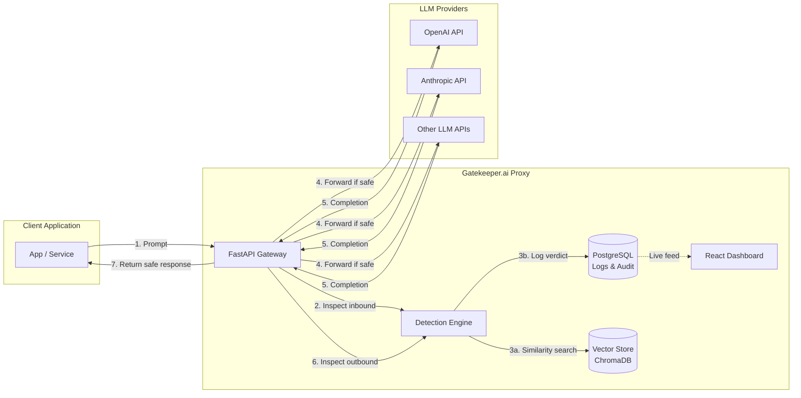
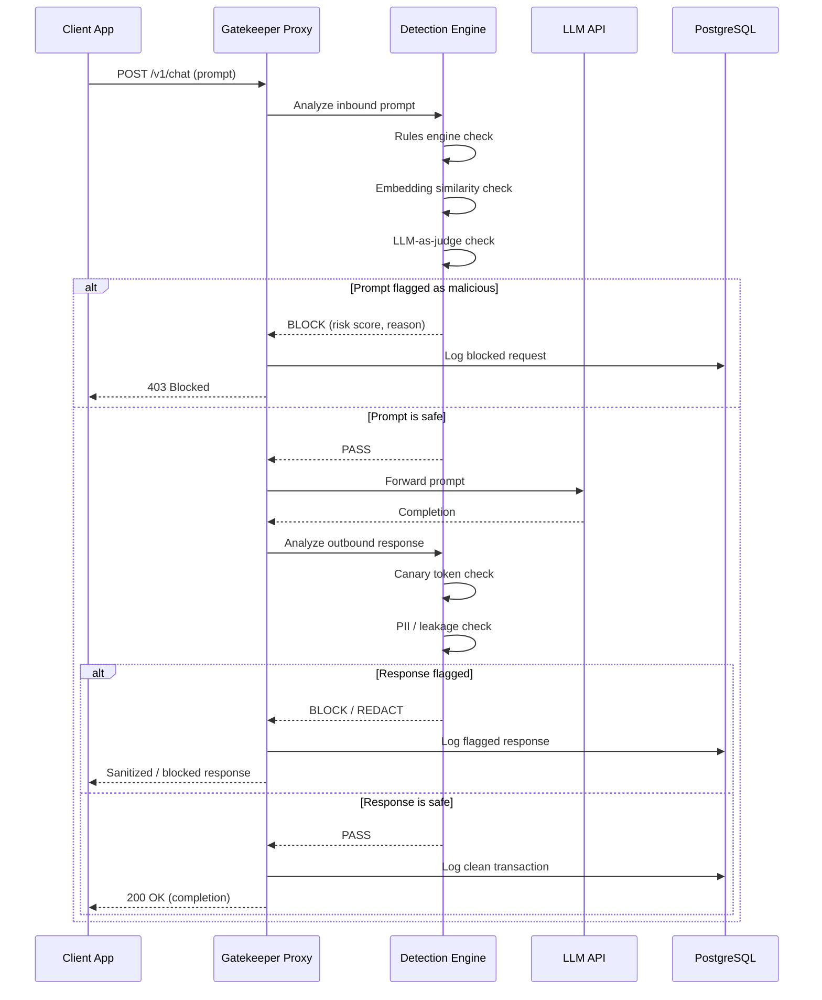
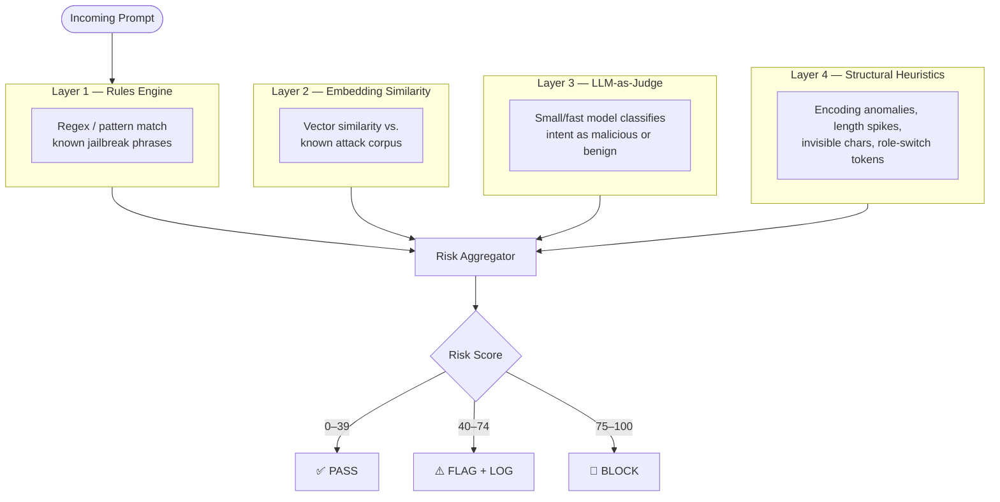
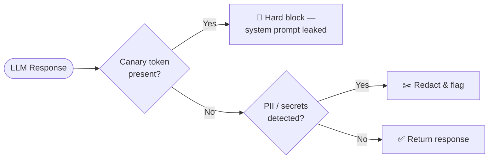

# 🛡️ Gatekeeper.ai

**An LLM Prompt-Injection Firewall** — a proxy service that sits between client applications and LLM APIs (OpenAI, Anthropic, etc.) to detect and block prompt injection, jailbreak attempts, and data exfiltration in real time.


---

## Table of Contents

- [Overview](#overview)
- [System Architecture](#system-architecture)
- [Request Flow](#request-flow)
- [Detection Pipeline](#detection-pipeline)
- [Tech Stack](#tech-stack)
- [Folder Structure](#folder-structure)
- [Quick Start](#quick-start)
- [Roadmap](#roadmap)
- [License](#license)

---

## Overview

Gatekeeper.ai acts as a transparent security layer between your application and any LLM provider. Every prompt going **in** and every completion coming **out** passes through a multi-layer detection pipeline before it's allowed through — giving you a WAF-style audit trail, real-time blocking, and risk scoring for your entire LLM traffic.

**Core capabilities:**

- 🔍 Inbound inspection — jailbreaks, injection payloads, encoded/obfuscated attacks, role-confusion attempts
- 🔒 Outbound inspection — system prompt leakage, PII leakage, canary token detection
- 📊 Risk scoring (0–100) with reasoning, not just allow/block
- 📁 Full audit trail of every request/response pair
- ⚡ Sub-200ms added latency, designed to be production-viable

---

## System Architecture



---

## Request Flow



---

## Detection Pipeline

Each layer runs independently and contributes to a combined risk score — no single layer is a single point of failure.



**Outbound-only layer:**



---

## Tech Stack

| Layer | Technology | Purpose |
|---|---|---|
| **Backend** | Python, FastAPI | Async proxy gateway + API |
| **Frontend** | React, Vite, Tailwind CSS | Real-time monitoring dashboard |
| **Database** | PostgreSQL | Request logs, audit trail, rule configs |
| **Vector Search** | ChromaDB *(Phase 2+)* | Embedding-based attack similarity search |
| **Containers** | Docker Compose | Local orchestration of all services |
| **Migrations** | Alembic | Database schema versioning |

---

## Folder Structure

```
gatekeeper.ai/
├── backend/                   # FastAPI application (feature-based modules)
│   ├── app/
│   │   ├── core/               # Config, settings, security utils
│   │   ├── api/                 # Versioned routers (/v1)
│   │   ├── features/
│   │   │   ├── proxy/           # Core proxy forwarding logic
│   │   │   ├── detection/
│   │   │   │   ├── rules_engine/
│   │   │   │   ├── embedding_similarity/
│   │   │   │   ├── llm_judge/
│   │   │   │   └── canary_tokens/
│   │   │   ├── logging_audit/
│   │   │   ├── auth/
│   │   │   └── dashboard_api/
│   │   ├── db/                  # Models, schemas, migrations
│   │   ├── services/            # Shared cross-feature services
│   │   └── middleware/
│   └── tests/
├── frontend/                  # React dashboard (feature-based modules)
│   └── src/
│       ├── features/
│       │   ├── dashboard/
│       │   ├── logs/
│       │   ├── alerts/
│       │   ├── settings/
│       │   └── auth/
│       ├── components/
│       ├── hooks/
│       ├── services/
│       ├── store/
│       └── routes/
├── docker/                    # Dockerfiles and docker-compose
├── docs/                      # Architecture notes and API documentation
└── scripts/                   # Dev and setup scripts
```

See each subdirectory's `README.md` for details on its role.

---

## Quick Start

> Setup instructions will be finalized in Phase 2. For now, use the stubs below to verify the stack boots end-to-end.

### Backend

```bash
cd backend
python -m venv .venv
source .venv/bin/activate   # Windows: .venv\Scripts\activate
pip install -r requirements.txt
uvicorn app.main:app --reload --host 0.0.0.0 --port 8000
```

Health check → [http://localhost:8000/health](http://localhost:8000/health)

### Frontend

```bash
cd frontend
npm install
npm run dev
```

App → [http://localhost:5173](http://localhost:5173)

### Docker Compose (all services)

```bash
docker compose -f docker/docker-compose.yml up --build
```

| Service | Port |
|---|---|
| Backend API | `8000` |
| Frontend | `5173` |
| PostgreSQL | `5432` |
| ChromaDB *(Phase 2+)* | `8001` |

---

## Roadmap

- [x] **Phase 1** — Feature-based project scaffolding, runnable stubs
- [ ] **Phase 2** — Core proxy: forward requests to LLM APIs, Postgres logging, healthchecks
- [ ] **Phase 3** — Detection engine: rules, embedding similarity, LLM-as-judge, canary tokens
- [ ] **Phase 4** — Risk scoring aggregator + block/flag/allow decision logic
- [ ] **Phase 5** — Real-time dashboard: live attack feed, logs, alerts
- [ ] **Phase 6** — SDK wrapper (`pip install gatekeeper-ai`) for drop-in integration
- [ ] **Phase 7** — Auth, rate limiting, multi-tenant support

---

## License

TBD